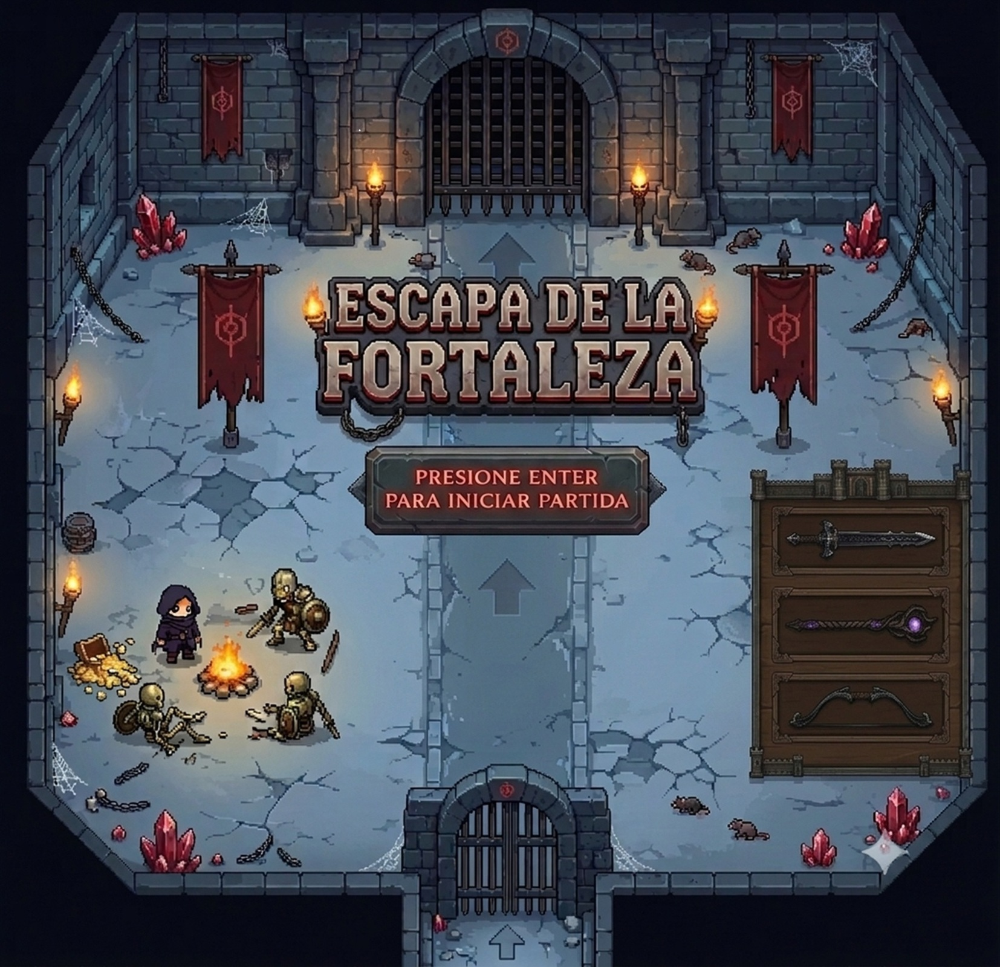

# Escapa de la prisión

## Equipo de desarrollo

- Fernandez, Ramiro
- Perez, Nicole
- Sanchez, Geronimo

## Capturas 

## Reglas de Juego / Instrucciones

Un prisionero debe escapar de una fortaleza atravesando 3 niveles, cada uno con más enemigos y de mayor dificultad que el anterior.

Al arrancar el juego aparece un menú principal:
- **ENTER**: empezar la partida.

Controles durante el juego:
- **WASD** o **flechas**: moverse.
- **K**: atacar con el arma equipada.
- **ENTER**: elegir un arma / confirmar.
- **R**: reiniciar el nivel actual.

Al comenzar cada nivel, el prisionero aparece frente a 3 armas (espada, báculo y arco, cada una con su propio alcance y poder de ataque). Al elegir una, las demás desaparecen y recién ahí los enemigos empiezan a acercarse. Un nivel se completa al derrotar a todos sus enemigos, lo que habilita la puerta de salida al siguiente nivel. Al completar el nivel 3 se gana la partida; si la vida del prisionero llega a 0 en cualquier nivel, se pierde. En ambos casos se vuelve al menú principal.

## Otros

- Objetos 1 c4, UNQ
- Version Wollok: "4.2.3"
- Una vez terminado, no tenemos problemas en que el repositorio sea público.